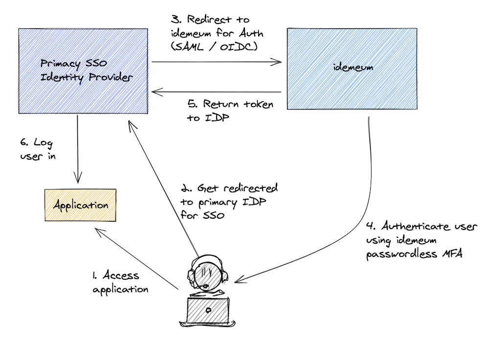

# Enterprise Single Sign-On

idemeum can act as a [SAML](https://en.wikipedia.org/wiki/Security_Assertion_Markup_Language) or [OIDC](https://openid.net/connect/) 3rd party Identity Provider. Therefore, it can be federated with existing SSO enterprise identity providers such as Okta or Microsoft Azure Active Directory to provide passwordless MFA experience. 

Once idemeum is integrated, employees can use idemeum mobile app to access corporate resources, including SSO applications, VPN resources, and virtual desktops. 

  
## Supported SSO MFA integrations

<a href="/azuread/">

    

      
      <h6>Azure Active Directory</h6>
      

        
Learn how to integrate Azure AD with idemeum passwordless MFA.

      

    

  
   
</a>

	
<a href="/ws1access/">

    

      
      <h6>VMware WS1 Access</h6>
      

        
Passwordless MFA integration with VMware Workspace ONE Access.

      

    

  
    
 </a>

<a href="/okta/">

    

      
      <h6>Okta</h6>
      

        
Integrate Okta with idemeum passwordless MFA.

      

    

  
   
</a>

<a href="/google/">

    

      
      <h6>Google Cloud Identity</h6>
      

        
Integrate Google Cloud Identity with idemeum passwordless MFA.

      

    

  
   
</a>

## How enterprise integration works
Typical integration would have all your SaaS or on-premises applications federated with your existing Identity Provider. And then having idemeum handle all authentication requests for your users. In this case idemeum becomes passwordless Multi Factor authentication for your users.

