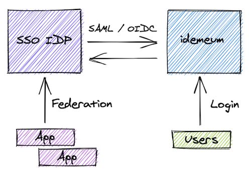

# Enterprise Single Sign-On :office:

idemeum can also be easily integrated with [Single Sign-On](https://en.wikipedia.org/wiki/Single_sign-on) deployments as it supports [SAML](https://en.wikipedia.org/wiki/Security_Assertion_Markup_Language) and [OIDC](https://openid.net/connect/) protocols. 

idemeum can act as 3rd party Identity Provider to your existing SSO deployment and handle all user authentication requests. Today idemeum supports a wide range of SSO products including Okra, Azure AD (B2B), WS1 Access, and others. 

Typical integration would have all your SaaS or on-premises applications federated with your existing Identity Provider. And then having idemeum handle all authentication requests for your users. In this case idemeum becomes passwordless Multi Factor authentication for your users.  
